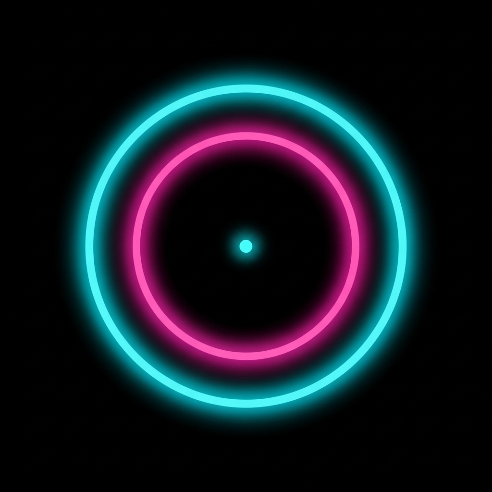

<p align="center">
  
</p>

<h1 align="center">RINGLOCK</h1>

<p align="center">
  <em>Zamanlamana güven. Halkayı kilitle. Rekoru kır.</em>
</p>

<p align="center">
  
  
  
  
</p>

<p align="center">
  
  
  
  
</p>

---

## Oyun Nedir?

RingLock, tek dokunuşla oynanan bir **zamanlama hassasiyet** oyunudur.

Dışarıdan büzülen pembe halka, sabit duran cyan hedef halkasıyla tam örtüştüğünde ekrana dokun. Ne erken, ne geç — tam zamanında.

> Öğrenmesi 5 saniye, ustalaşması ömür boyu.

---

## Oyun Modları

| Mod | Açıklama | Kilidi |
|-----|----------|--------|
| **KLASİK** | 3 can, her isabette hız artar | Hep açık |
| **ZORLU** | 1 can, maksimum hız | Hep açık |
| **ZEN** | Sınırsız can, tempolu meditasyon | Hep açık |
| **HIZ** | 60 saniye sayaç, puan yarışı | Hep açık |
| **AYNA** 🔒 | Halka dıştan içe değil, içten dışa büyür | 10+ puan |
| **İKİZ** 🔒 | 2 eş zamanlı halka, %20 hız farkı, her ikisin vur | 25+ puan |

---

## İsabet Sistemi

Halkalar örtüştüğünde dokunma mesafene göre puan kalitesi belirlenir:

| Kalite | Hassasiyet | Ses | Efekt |
|--------|-----------|-----|-------|
| ✨ **MÜKEMMEL** | ±5 px | Çift ton ding | Parçacık patlaması |
| ✅ **İYİ** | ±10 px | Tek ton | Flaş |
| ⚠️ **GEÇ** | ±18 px | Alçak ton | Hafif flaş |
| ❌ **KAÇIŞ** | Dışarıda | İnen buzz | Ekran sarsıntısı |

**Kombo sistemi:** Arka arkaya isabetler komboyu yükseltir. Her 10 komboda özel ses efekti. Her 15 komboda (can modlarında) ekstra can.

---

## Görsel & Ses Deneyimi

### Temalar
- **6 halka teması** — Neon Cyan, Ateş, Mor Şimşek, Elektrik Mavi, Altın, Kan
- **5 arka plan teması** — Void, Okyanus, Şafak, Aurora, Güneş

### Sesler
Tüm sesler sıfırdan üretilmiş WAV dosyaları:
- `perfect.wav` — 880Hz + 1320Hz çift harmonik, parlak ding
- `good.wav` — 660Hz temiz ton
- `late.wav` — 440Hz yumuşak ton
- `miss.wav` — 320→140Hz inen buzz
- `combo_high.wav` — 1046Hz + 1318Hz yükselen çift ton (10+ komboda)
- `gameover.wav` — dramatik bitiş müziği

### Erişilebilirlik
- iOS **"Hareketi Azalt"** sistem ayarına tam uyum (animasyonlar, sarsıntı, parçacıklar devre dışı)
- **Büyük metin** modu — skor ve etiketlerde font boyutu artırılır
- **Yüksek kontrast** modu — halka çizgisi kalınlaşır, renkler güçlenir

---

## İlerleme Sistemi

### 22 Başarım

<details>
<summary>Tüm başarımları gör</summary>

| # | Başarım | Koşul |
|---|---------|-------|
| 1 | İLK ADIM | İlk skoru yap |
| 2 | ONluk | 10 puana ulaş |
| 3 | ETKİLEYİCİ | 25 puana ulaş |
| 4 | EFSANE | 50 puana ulaş |
| 5 | TANRI | 100 puana ulaş |
| 6 | MÜKEMMELCI | Tek oyunda 5 MÜKEMMEL |
| 7 | ULTRA HASSAS | Tek oyunda 15 MÜKEMMEL |
| 8 | KUSURSUZ | 10+ puan, hiç kaçış yok |
| 9 | İZLEYİCİ | 10 oyun oyna |
| 10 | DEVASİ | 50 oyun oyna |
| 11 | TUTKULU | 100 oyun oyna |
| 12 | COMBO BAŞLANGICI | 5x kombo |
| 13 | COMBO USTASI | 10x kombo |
| 14 | COMBO EFSANESİ | 20x kombo |
| 15 | ZEN USTASI | Zen modda 30 puan |
| 16 | SPEED DEMONu | Hız modunda 40 puan |
| 17 | ZORLU KAHRAMAN | Zorlu modda 20 puan |
| 18 | DAYANIKLI | Zorlu modda 50 puan |
| 19 | AYNA USTASI | Ayna modunda 15 puan |
| 20 | TERSYÜZ | Ayna modunda 30 puan |
| 21 | ÇİFT YETENEK | İkiz modunda 10 puan |
| 22 | İKİZ EFSANE | İkiz modunda 25 puan |

</details>

### Diğer İlerleme Özellikleri
- **Günlük görev** — her gün farklı bir mod/hedef
- **Streak takibi** — kaç gün üst üste oynadın
- **İstatistik paneli** — toplam oyun, toplam skor, mod bazlı en iyiler, en iyi kombo
- **Skor paylaşımı** — sonuç ekranından direkt paylaş

---

## Teknik Yığın

```
Expo SDK 54              Çapraz platform çerçevesi
React Native 0.81        UI katmanı
expo-router              Dosya tabanlı yönlendirme
Reanimated 3             60fps UI thread animasyonları (useSharedValue)
expo-av                  WAV ses oynatma
expo-haptics             Dokunsal geri bildirim (titreşim)
AsyncStorage             Yerel veri kalıcılığı
Orbitron (Google Fonts)  Cyberpunk yazı tipi (400 / 700 / 900)
```

---

## Proje Yapısı

```
ringlock/
├── app/
│   ├── index.tsx               # Ana oyun ekranı & HUD bileşenleri
│   └── _layout.tsx             # Root layout, ses init, font yükleme
├── components/
│   ├── TargetRings.tsx         # Halka animasyonları (Reanimated)
│   ├── ModeSelect.tsx          # Mod seçim ekranı + kilit sistemi
│   ├── GameOverOverlay.tsx     # Oyun sonu istatistik ekranı
│   ├── ScoresOverlay.tsx       # İstatistik paneli
│   ├── AchievementsOverlay.tsx # Başarım galerisi
│   ├── DailyChallengeOverlay.tsx
│   ├── ThemeOverlay.tsx
│   ├── TutorialOverlay.tsx
│   ├── ParticleEffect.tsx      # MÜKEMMEL parçacık patlaması
│   └── GridBackground.tsx      # Cyberpunk ızgara arka planı
├── hooks/
│   └── useGameLoop.ts          # Oyun mantığı çekirdeği & durum makinesi
├── lib/
│   ├── sounds.ts               # Ses yöneticisi
│   ├── achievements.ts         # 22 başarım mantığı
│   ├── dailyChallenge.ts       # Günlük görev sistemi
│   ├── streak.ts               # Seri takibi
│   ├── ThemeContext.tsx         # Tema sistemi (6 halka + 5 arka plan)
│   └── SettingsContext.tsx      # Ayarlar (ses, titreşim, erişilebilirlik)
├── constants/
│   └── game.ts                 # Oyun sabitleri, mod tanımları, renkler
└── assets/
    ├── icon.png                # 1024×1024 App Store ikonu
    ├── splash.png              # Açılış ekranı
    └── sounds/                 # Üretilmiş WAV ses efektleri
```

---

## Kurulum

### Gereksinimler
- Node.js 18+
- Expo Go uygulaması ([iOS](https://apps.apple.com/app/expo-go/id982107779) / [Android](https://play.google.com/store/apps/details?id=host.exp.exponent))

```bash
# Repoyu klonla
git clone https://github.com/fth530/ringlock.git
cd ringlock

# Bağımlılıkları yükle
npm install

# Geliştirme sunucusunu başlat
npx expo start
```

QR kodu Expo Go ile tara ve telefonunda oyna.

### Production Build (EAS)

```bash
npm install -g eas-cli
eas login

# iOS
eas build --platform ios --profile production

# Android
eas build --platform android --profile production
```

---

## App Store Hazırlığı

| Öğe | Durum |
|-----|-------|
| Bundle ID (`com.ringlock`) | ✅ app.json'da ayarlı |
| iOS Build Number | ✅ `"buildNumber": "1"` |
| Android Version Code | ✅ `"versionCode": 1` |
| Export Compliance | ✅ `ITSAppUsesNonExemptEncryption: false` |
| Mikrofon izni | ✅ `microphonePermission: false` |
| EAS Build config | ✅ eas.json hazır |
| App Store metadata | ✅ app-store-metadata.md (TR + EN) |
| Uygulama ikonu 1024px | ✅ Neon cyberpunk tasarım |
| Reduced Motion desteği | ✅ iOS sistem ayarına uyumlu |

---

## Platform Desteği

| Platform | Durum |
|----------|-------|
| iOS 16+ | ✅ Tam destek |
| Android 8.0+ | ✅ Tam destek |
| Web | ⚠️ Temel destek (haptic yok) |

---

## Lisans

MIT © 2026 RingLock

---

<p align="center">
  Cyberpunk ruhla, React Native ile yapıldı
</p>
